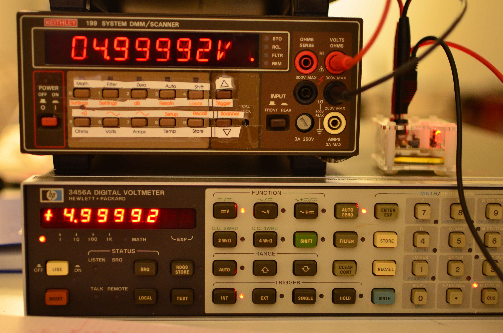

# Keithley 199 Digital Board Replacement



This is an upgrade replacement for the digital control board on Keithley 199 multimeters.

The [Keithley 199](doc/k199_op_maint.pdf) is a digital multimeter built in the nineties. It is capable of current, voltage and resistance measurements and also provides a gpib interface for remote control.

These multimeters contains three electronic circuit boards, one which contains the analog circuitry, including analog signal conditioning and analog digital converter, a display board which contains the user interface, and a digital control board, with a processor who controls display, gpib interface and analog digital converter.

This repository contains hardware and software files needed to build a replacement of the digital control board.

# Features
- Voltage Measurement 0.3, 3, 30, 300 VDC/VAC 6.5 digits
- Current Measurement 30mA, 3A DC/AC,  6.5 digits
- Resistance Measurement 300-3GOhm, 6.5 digits, 4 wire.
- Arbitrary integration period
- SCPI interface
- Free Software


# Building the hardware 

The hardware files are in [Kicad](http://kicad-pcb.org/) format. Gerber files are (not yet) available.

# Building the software

The software was built with the [Microchip Toolchain](http://www.microchip.com/mplab/compilers). 

We use [Ceedling](http://www.throwtheswitch.org/ceedling/) for building and testing (but for comfort, [MPLABX](http://www.microchip.com/mplab/mplab-x-ide) files are available). 

In order to build the software, go to the root directory and do:

```
$rake release

```
Or to perform the unit tests:
```
$rake test:all
```


## Hardware

The hardware is pretty basic. It contains a pic32mx controller which do the heavy lifting. An ftdi chip provides an usb interface, while two open drain drivers controll the led displays. The external trigger input and output are connected to the microcontroller through the necessary input/output protection.

## Software 

The interesting part is the Control of the analog board. The analog board contains a series of switches that are controlled with a shift register. The adc conversion is performed with a discrete charge-balance adc which returns a pulse train with a pulse count proportional to the input voltage. The control of the adc is performed by the microcontroller in the digital board and should observe a precise timing in order to guarantee adc accuracy.


# Licence

```
 * Copyright (c) 2015, Diego F. Asanza. All rights reserved.
 *
 * This software is free software; you can redistribute it and/or
 * modify it under the terms of the GNU Lesser General Public
 * License as published by the Free Software Foundation; either
 * version 2.1 of the License, or (at your option) any later version.
 *
 * This library is distributed in the hope that it will be useful,
 * but WITHOUT ANY WARRANTY; without even the implied warranty of
 * MERCHANTABILITY or FITNESS FOR A PARTICULAR PURPOSE.  See the GNU
 * Lesser General Public License for more details.
 *
 * You should have received a copy of the GNU Lesser General Public
 * License along with this library; if not, write to the Free Software
 * Foundation, Inc., 51 Franklin Street, Fifth Floor, Boston,
 * MA 02110-1301  USA
 *
 ```